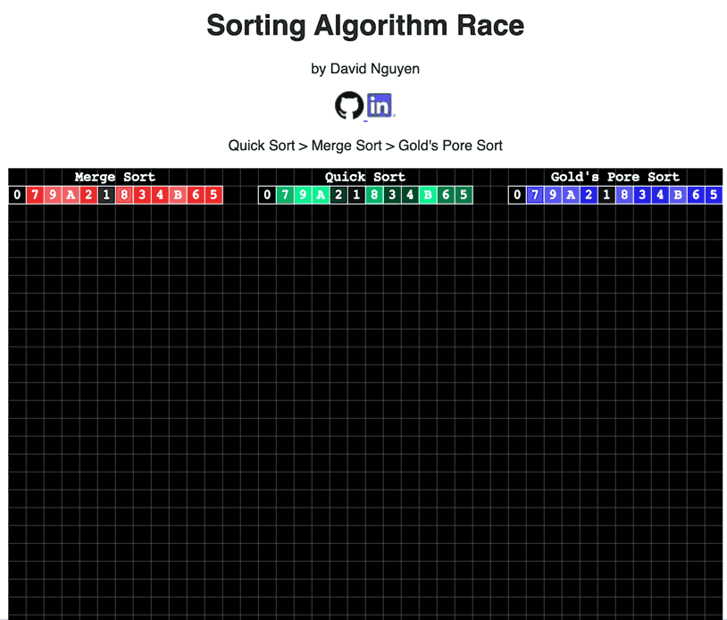

# Visualizing Sorting Algorithms with a race

https://david-kishi.github.io/visualizing-sort-race/

## Class Number

California State University Fullerton 
CPSC 335-02 
Algorithm Engineering

## Project Number and Name

No.: 2 
Name: Sorting Algorithm Race 

## Team Name and Members

Team Name: AlgoSolo 
Members:
* David Nguyen

## Intro

The Sorting Algorithm Race is a sorting race between the three algorithms; merge sort, quick sort, and gold's pore sort.

**Quick Sort**, the fastest of the 3, has a time complexity of **O(Log N)**, but is very unpredictable and complex.

**Merge Sort**, the second fastest, has a time complexity of **O(N Log N)** and has a very predictable *S* pattern that you can see in the visualization.

**Gold's Pore Sort**, the slowest of the 3, has a time complexity of **O(N^2)**, but is very likable and easy to implement in parallel computating.

## Contents

img/GitHub-Mark-32px.png - GitHub Logo 
img/LinkedIn-Bug-32px.png - LinkedIn Logo 
img/SortingAlgoRace.gif - Sorting Algorithm Race Preview 
static/css/styles.css - Stylesheet 
static/js/cs-sketch.js - Renders Sorting Algorithm Race 
static/js/draw_stuff.js - Draws a grid (only works if bg is set to white) 
static/js/p5.js - p5.js library for drawing 
index.html - index page that holds the Sorting Algorithm Race demo 
README.md - What you're currently reading. 
README.txt - Plain ASCII of what you're currently reading. 

## External Requirements

Please use a browser with ES6 capabilities.
| Browser | Minimum Version |
|---------|-----------------|
| Chrome  | 51              |
| Firefox | 54              |
| Edge    | 14              |
| Safari  | 10              |
| Opera   | 38              |

## Setup and Installation

Run index.html on a local server or open in browser. 
You may also visit https://david-kishi.github.io/visualizing-sort-race/

## Sample Invocation

## Features

 - Press any button to resume/pause
 - ***(Missing)*** Instruction outputs to follow along.

## Bugs

None reported.

## Contact

David Nguyen - david@knytes.com
